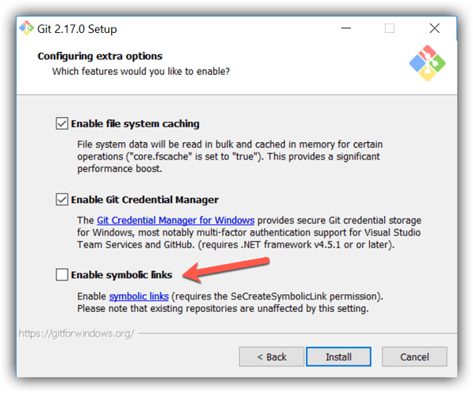
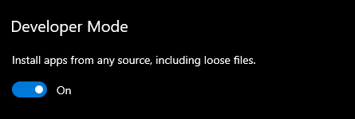
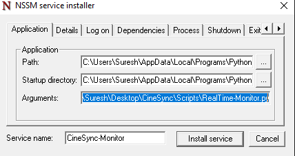
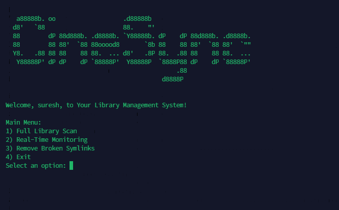
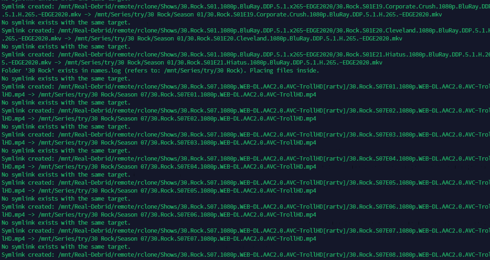
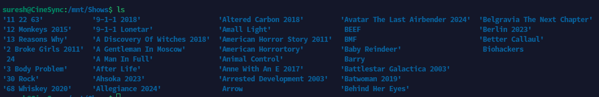
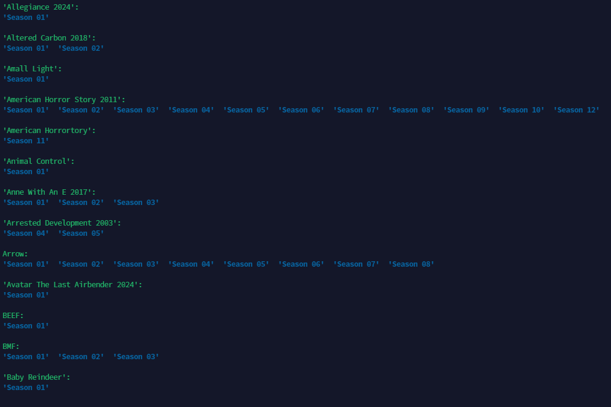
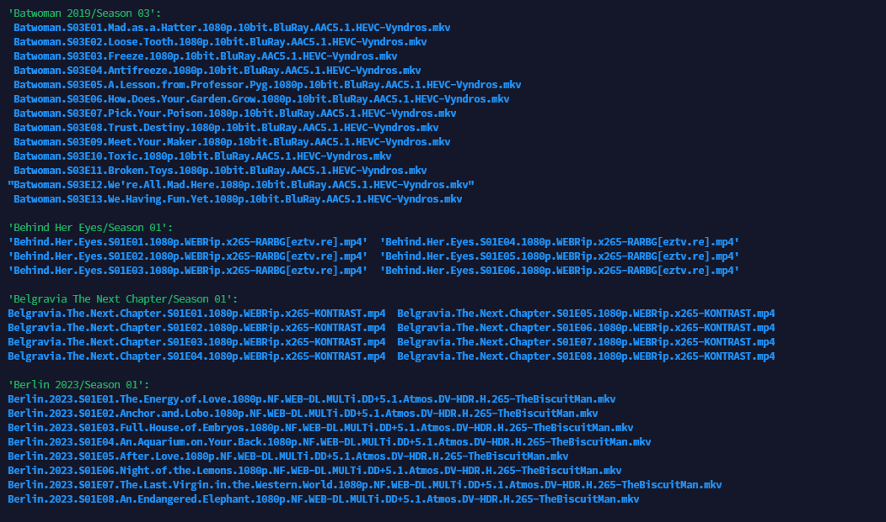
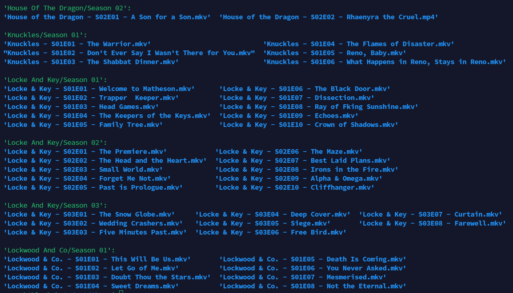
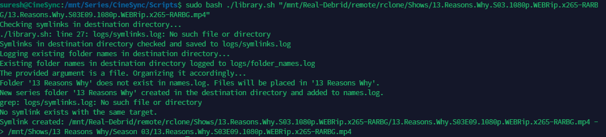

# CineSync - Organize Your Debrid Library Easily

CineSync is a Python-based library management system designed to efficiently organize debrid libraries for TV shows, eliminating the need for Sonarr/Radarr. Users downloading from DMM Manager can seamlessly sort their library into seasons, whether it's a single file or a folder. CineSync streamlines the organization of your library and creates symbolic links, providing full control over your data locally. While highly optimized for debrid platforms, CineSync is also versatile and works effectively with non-debrid platforms.

# General Info

CineSync works by creating symbolic links from the source directory to the destination directory and organizing them according to the user's preferences. This allows users to maintain a well-structured library without physically moving or duplicating the original files.

## Docker Hub Repository

The CineSync Docker image is available on Docker Hub:

- [CineSync Docker Image](https://hub.docker.com/r/sureshfizzy/cinesync)

## Supported Architectures

- `amd64` (x86_64)
- `arm64` (aarch64)

## Features

- **Library Organization:** Easily sort your library into seasons, regardless of file or folder structure.
- **Faster Scan:** CineSync has been optimized for faster file and directory scanning. Improved directory checks, file handling, and multi-threaded processing (controlled by `MAX_PROCESSES`) help speed up the scan process, especially for large libraries.
- **Symbolic Link Creation:** Create symbolic links to organize your library without moving or duplicating files.
- **Real-Time Monitoring for Files:** Monitor the watch directory for any new files and automatically create symbolic links for them, ensuring your library stays updated in real-time. (Configurable monitoring interval via `SLEEP_TIME`).
- **Support for Single Symlinks Creation:** CineSync now supports creating symbolic links for single files or folders, providing flexibility in managing your library.
- **Ability to Skip Already Present Symlinks:** CineSync includes the ability to skip the creation of symbolic links for files or folders that are already present, even if the folder name is different. This feature ensures efficient management of your library by preventing duplicate symlinks.
- **Rename Files:** Properly rename your files based on TMDb data when `RENAME_ENABLED=true`.
- **Cross-Platform Support:** Works on both Linux and Windows operating systems.
- **Movie Collection-Based Separation:** Organize movies into collections based on TMDb or IMDb data, ensuring that all movies from the same collection are grouped together. (Enabled via `MOVIE_COLLECTION_ENABLED`).
- **Docker Support:** Easily deploy CineSync in a Docker container for consistent and isolated environments.
- **TMDb ID Integration:** Utilize TMDb IDs for more precise organization and naming of your media files.
- **Automatic Separation of Extras and Resolutions:** Automatically separate extras from main episodes and sort files based on resolution (e.g., 720p, 1080p, 4K), ensuring a well-organized library. (Configurable via `SKIP_EXTRAS_FOLDER`).
- **Resolution-Based File Sorting:** Separate files based on resolution (e.g., 720p, 1080p, 4K) for easier organization. If resolution-based separation is not enabled, files will be organized based on the source folder structure.
- **Database Configuration:** Optimized for efficient database operations with configurable throttle rates, retry mechanisms, and batch processing to manage media metadata and symlink creation. (Controlled via `DB_*` variables).
- **Rclone Mount Verification:** CineSync supports checking if rclone mount points are available before processing files. This feature is useful for managing remote storage and ensures the mount is active before symlink creation. (Enabled via `RCLONE_MOUNT`).

## Real-Time Monitoring

CineSync now includes a fully integrated real-time monitoring feature that automatically tracks changes in your media library. This functionality is particularly useful for handling series or shows that are regularly downloaded, ensuring that your library stays up-to-date without manual intervention.

### How it works:

- **Initial Full Scan:** Upon starting, CineSync will first perform a full scan of your library to organize and identify all existing files and folders.

- **Automatic Trigger:** Once the full scan is completed, the real-time monitoring will automatically trigger, and from that point on, CineSync will continuously monitor your designated watch directory for new files or folders.

- **Watch Directory:** CineSync continuously monitors the watch directory where new files or folders are expected to be added.

- **Monitoring Interval:** By default, CineSync checks the watch directory every 60 seconds for any changes. You can modify this interval by adjusting the `SLEEP_TIME` variable in the configuration file.

- **Automatic Identification:** When a new file or folder is detected, CineSync automatically identifies it based on its naming conventions and other factors.

- **Symbolic Link Creation:** Once identified, CineSync creates symbolic links for the newly added file or folder. This ensures that your library remains organized without physically moving or duplicating files, preserving disk space.

- **Efficiency:** Real-time monitoring allows users to stay up-to-date with library changes automatically. It streamlines the process of handling daily series or shows by organizing new additions without requiring manual input.

- **Customization:** You can easily customize the monitoring interval and other settings to better suit your specific needs and library requirements.

CineSync’s real-time monitoring is now a core feature of the script and Docker images, allowing for seamless integration into your workflow. With this feature, users can effortlessly manage their media library and maintain a well-organized collection of files.

## Getting Started

## Requirements

- Python 3.x
- For Windows: Git Bash with symbolic links enabled
- NSSM for Windows (if you want to enable real-time monitoring).
- [Zurg](https://github.com/debridmediamanager/zurg-testing) (optional)

## Configuration Variables

Make sure to edit the `.env` file before running the script. Below are the configurable variables used in the script, along with their descriptions and default values:

| Variable                        | Description                                                                                                                   | Default Value                  |
|---------------------------------|-------------------------------------------------------------------------------------------------------------------------------|--------------------------------|
| `SOURCE_DIR`                    | The directory path where the source files are located. Multiple directories can be specified, separated by commas. Use `\` for Windows paths. | `/path/to/files`               |
| `DESTINATION_DIR`               | The path to the destination directory where the symlinks or files will be placed. Use `\` for Windows paths. | `/path/to/destination`         |
| `LOG_LEVEL`                     | Defines the level of logging. Available options: `DEBUG`, `INFO`, `WARNING`, `ERROR`, `CRITICAL`.                           | `INFO`                         |
| `RENAME_ENABLED`                | Enable or disable file renaming functionality based on TMDb data.                                                              | `false`                        |
| `TMDB_API_KEY`                  | Your TMDb API key (short version, not the full read access token). Obtain this key from your TMDb account settings.           | `your-api-key`                 |
| `MOVIE_COLLECTION_ENABLED`      | Enable or disable separating movie files based on collections. When true, movies will be organized into folders according to their collections (e.g., Harry Potter series). | `false`                        |
| `RELATIVE_SYMLINK`              | Create relative symlinks instead of absolute symlinks. When true, symlinks will use relative paths.                           | `false`                        |
| `MAX_PROCESSES`                 | Set the maximum number of parallel processes for creating symlinks. Increase this number to speed up processing if you have a multi-core CPU. Set to 1 for single-threaded processing to minimize system load. | `1`                            |
| `SKIP_EXTRAS_FOLDER`            | Enable or disable the creation and processing of extras folder files. When true, files meant for the 'Extras' folder will be skipped. | `true`                         |
| `SLEEP_TIME`                    | Sleep time (in seconds) for real-time monitoring script. Determines how frequently the script checks for changes in watch directories. | `60`                           |
| `RCLONE_MOUNT`                  | Enable or disable rclone mount verification. When true, the system will verify if directories are properly mounted via rclone and wait for mount points to become available before processing. Useful for remote storage. | `false`                        |
| `MOUNT_CHECK_INTERVAL`          | Interval (in seconds) for checking rclone mount availability. Only relevant when `RCLONE_MOUNT=true`. | `30`                           |
| `SKIP_ADULT_PATTERNS`           | Enable or disable skipping specific file patterns. When true, files matching patterns defined in `utils/keywords.json` will be excluded. | `true`                         |

### Database Configuration

| Variable                        | Description                                                                                                                   | Default Value                  |
|---------------------------------|-------------------------------------------------------------------------------------------------------------------------------|--------------------------------|
| `DB_THROTTLE_RATE`              | Throttle rate for database operations (requests per second). Higher values may increase performance but also resource usage.    | `100`                          |
| `DB_MAX_RETRIES`                | Maximum number of retries for database operations in case of failure. Set to 0 to disable retries.                             | `10`                           |
| `DB_RETRY_DELAY`                | Delay (in seconds) between retry attempts for database operations.                                                             | `1.0`                          |
| `DB_BATCH_SIZE`                 | Batch size for processing records from the database. Increasing this value can improve performance but may use more memory.     | `1000`                         |
| `DB_MAX_WORKERS`                | Maximum number of parallel workers for database operations. Adjust this value based on your system’s capabilities.             | `4`                            |

### Database Configuration Explanation

- **`DB_THROTTLE_RATE`**: This variable controls the rate at which database operations are performed, measured in requests per second. For example, if `DB_THROTTLE_RATE` is set to `1`, the script will make one database operation every second. This can help control the load on the database, especially if it’s being accessed over a network.

- **`DB_BATCH_SIZE`**: This defines the number of records to process at once during each database operation. A larger batch size can increase performance, but it also requires more memory. For example, setting `DB_BATCH_SIZE` to `10` means the script will attempt to process 10 records at once. 

- **`DB_MAX_RETRIES`**: This defines how many times the script will retry a failed database operation. If set to `0`, no retries will occur. For example, if the database is temporarily unavailable, the script will attempt the operation again up to 10 times if `DB_MAX_RETRIES` is set to `10`.

- **`DB_RETRY_DELAY`**: This is the time in seconds to wait before retrying a failed database operation. For example, with a value of `1.0`, the script will wait 1 second before attempting the same database operation again.

- **`DB_MAX_WORKERS`**: This defines how many parallel workers the script will use to perform database operations. For example, setting `DB_MAX_WORKERS` to `4` allows up to four parallel processes to run for database operations at once, which can speed up processing if you have multiple CPU cores.

#### Example:

If you want to process 1 file per second:

- **`DB_THROTTLE_RATE = 1`**: Limits the processing to one batch per second.
- **`DB_BATCH_SIZE = 1`**: Ensures that only one file is processed per batch, matching the 1-file-per-second rate.

In this case, the system will process 1 file every second, with one retry allowed in case of failure and a 1-second delay between retries.

If you want to process more files, such as 10 files per second:

- **`DB_THROTTLE_RATE = 1`**: Still limits the system to one batch per second.
- **`DB_BATCH_SIZE = 10`**: Each batch will contain 10 files, so 10 files will be processed every second in a single batch.

By adjusting `DB_THROTTLE_RATE` and `DB_BATCH_SIZE`, you can fine-tune the rate at which the script processes data and manages the load on your database and system.

### For Linux:

Here's an enhanced version of the instructions:

1. **Clone the Repository:** Clone the CineSync repository from GitHub and navigate to the cloned directory:
   ```
   git clone https://github.com/sureshfizzy/CineSync.git && cd CineSync
   ```

2. **Update Paths in `.env`:** Open the `.env` file located inside the `CineSync` folder. Update the following paths:
   - `SOURCE_DIR`: Specify the path for the Source directory.
   - `DESTINATION_DIR`: Set the ultimate destination directory where you want to save the symbolic links.
   - `TMDB_API_KEY`: Enter your TMDb API key to access TMDb services.

   Note: Ensure that the paths are correctly updated to reflect your system's configuration.

3. **Execute CineSync:** After updating the paths, execute the main script:
   - For Linux:
     ```bash
     python3 CineSync.py
     ```
   - For Windows:
     ```powershell
     python CineSync.py
     ```

   This will launch the CineSync interface, allowing you to perform various library management tasks, including full library scans, real-time monitoring, and more.

By following these steps and updating the necessary paths, you'll be able to successfully use CineSync to manage your debrid library.

### For Windows:

1. **Install Python:**
   Install Python from the official website: [Python.org](https://www.python.org/). Make sure to add Python to your system PATH during installation.

2. **Install Git Bash:**
   Install Git Bash from [Git for Windows](https://gitforwindows.org/). During installation, enable the symbolic links checkbox.



   Enabling symbolic links is important for certain operations, so ensure that the checkbox for symbolic links is checked during installation.

3. **Edit `.bashrc` (Windows):**
   Open Git Bash as an administrator and edit the `.bashrc` file. You can use the `nano` editor to open the file by running the following command:
   ```
   nano /etc/bash.bashrc
   ```
   Add the following line at the bottom of the file:
   ```
   export MSYS=winsymlinks:nativestrict
   ```
   Save the changes by pressing `Ctrl + O`, then press `Enter` to confirm. Exit the editor by pressing `Ctrl + X`.

   **Important:** Ensure that the `export MSYS=winsymlinks:nativestrict` line is added to the `.bashrc` file. This configuration is essential to ensure that symbolic links are handled correctly on Windows when using Git Bash. Without this setting, CineSync may copy files instead of creating symbolic links, leading to undesired behavior.

4. **Enable Windows Developer Mode:**

	Enabling Developer Mode grants your system additional privileges necessary for certain operations, helping to prevent permission-related errors during development.

	To avoid "Operation not permitted" errors during symlink process, it's essential to enable Windows Developer Mode. Follow these steps:

	- Open **Settings**.
	- Go to **Update & Security**.
	- Click on **For developers**.
	- Enable the **Developer mode** option.
	- Restart the PC

	

5. **Clone the Repository:**
   ```
   git clone https://github.com/sureshfizzy/CineSync.git
   ```

6. **Update Paths in `.env`:** Open the `.env` file located inside the `CineSync` folder. Update the following paths:
   - `SOURCE_DIR`: Specify the path for the Source directory.
   - `DESTINATION_DIR`: Set the ultimate destination directory where you want to save the symbolic links.
   - `TMDB_API_KEY`: Enter your TMDb API key to access TMDb services.

   Note: Ensure that the paths are correctly updated to reflect your system's configuration.

7. **Run the Script:**
   - For Linux:
     ```bash
     python3 CineSync.py
     ```
   - For Windows:
     ```powershell
     python CineSync.py
     ```

# Real-Time Monitoring on Windows using NSSM

This guide will walk you through the process of setting up real-time monitoring for CineSync Monitor on Windows using NSSM (Non-Sucking Service Manager). Real-time monitoring ensures that CineSync Monitor runs continuously in the background as a system service.

## Prerequisites

- **NSSM**: Download and install NSSM from the official website: [NSSM Releases](https://nssm.cc/download)

## Installation Steps

### 1. Download and Install NSSM

1. Download the latest version of NSSM from the official website.
2. Extract the downloaded ZIP file to a location on your computer.
3. Open the extracted folder and locate the `nssm.exe` executable.

### 2. Mount CineSync Monitor as a System Service

1. **Place NSSM Executable Inside the Scripts Folder**: Move the `nssm.exe` executable into the Scripts folder.

2. **Run NSSM Install Command**: Open a Command Prompt with administrative privileges, navigate to the Scripts folder, and run the following command:
   ```
   nssm install CineSync-Monitor
   ```

### 3. Configure NSSM

1. **Configure NSSM**: In the NSSM GUI that appears:
   - **Application Path**: Choose the `python.exe` executable. You can find it by opening Git Bash and running `which python`.
   - **Arguments**: Pass the folder path where `realtime-monitor.py` is located, for example: `C:\Users\YourUserName\Desktop\CineSync\Scripts\RealTime-Monitor.py`.
   - Click "Install Service".

	
	
2. **Set Source and Destination Paths**: Before running `realtime-monitor.py` as a system service, ensure that source and destination paths are correctly set inside `library.sh`.

3. **Run Real-Time Monitoring**: After installation, the files will be watched in real-time, and symlinks will be created if any changes are detected.

4. **Removing the System Service**: To remove the system service, simply type:
   ```
   nssm remove CineSync-Monitor
   ```

Additionally, you can also directly run the Python script on Git Bash if needed.

## Usage

CineSync provides a user-friendly interface for managing your debrid library. Upon running the script, you'll be presented with a main menu where you can choose from various options:

**Note:** All menu option features are fully configurable through the `.env` file. If you're using Docker, ensure that the configurations are set correctly within the `.env` file before pulling your Docker images.



- **1) Edit .env file:** Update Basic Configurations in this file.

- **2) Full Library Scan:** Perform a comprehensive scan of your entire library.

<div style="display: flex; justify-content: space-between;">
  
  
  
  
</div>

- **3) Real-Time Monitoring (Linux Only):** Enable real-time monitoring to stay updated on library changes. System services are automatically created, and the scan is triggered every 60 seconds. You can adjust the frequency inside `RealTime-Monitor.py`.
- **4) Remove Broken Symlinks :** Identify and remove broken symbolic links within your library.
- **5) TMDB Renamer:** Ability to perform renaming for all the files present in destination directory.



- **6) Exit:** Quit the CineSync application.

**Note:** Real-Time Monitoring is currently supported only on Linux due to system service limitations on Windows. However, you can still manually trigger real-time monitoring using the provided instructions in the README.

## Single File/Folder Symlink Creation

CineSync also supports the creation of single file or folder symlinks. Follow these steps to create a symlink for a single file or folder:

1. **Navigate to Scripts Folder:**
   - Open your terminal or command prompt and navigate to the Scripts folder of the CineSync repository.

2. **Enter Series Name and Full Path:**
   - Inside the Scripts folder, run the following command:
     ```bash
     bash ./library.sh "/mnt/Real-Debrid/remote/rclone/Shows/13.Reasons.Why.S03.1080p.WEBRip.x265-RARBG/13.Reasons.Why.S03E09.1080p.WEBRip.x265-RARBG.mp4"
     ```
     Replace `"/mnt/Real-Debrid/remote/rclone/Shows/13.Reasons.Why.S03.1080p.WEBRip.x265-RARBG/13.Reasons.Why.S03E09.1080p.WEBRip.x265-RARBG.mp4"` with the full path to the file or folder you want to create a symlink for.

3. **Execute Command:**
   - Press Enter to execute the command.

<div style="display: flex; justify-content: space-between;">
  
  
</div>

By following these steps, you can easily create a symlink for a single file or folder using CineSync.

## Contributors

- [Suresh S](https://github.com/sureshfizzy)❤️
- Special thanks to [Paolo](https://github.com/RunAway189) for testing the application.!
- [Buy Me a Coffee](https://www.buymeacoffee.com/Sureshfizzy)☕
