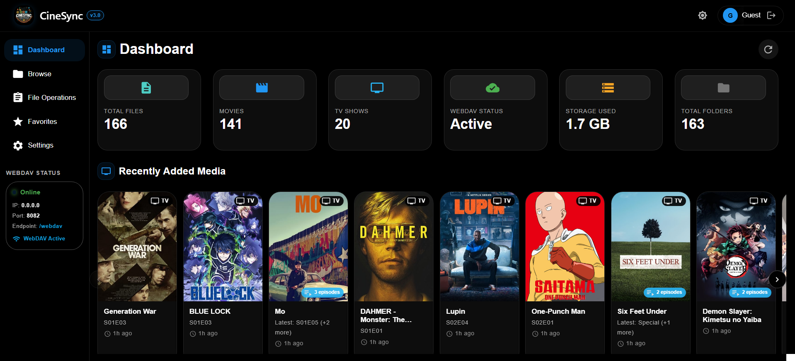
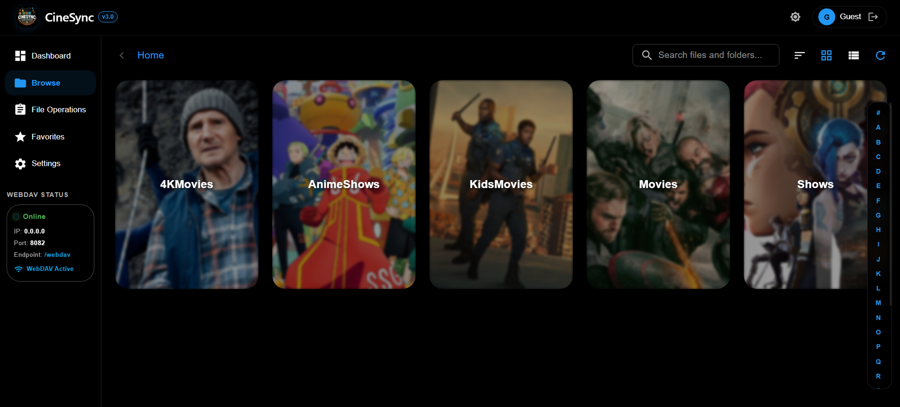
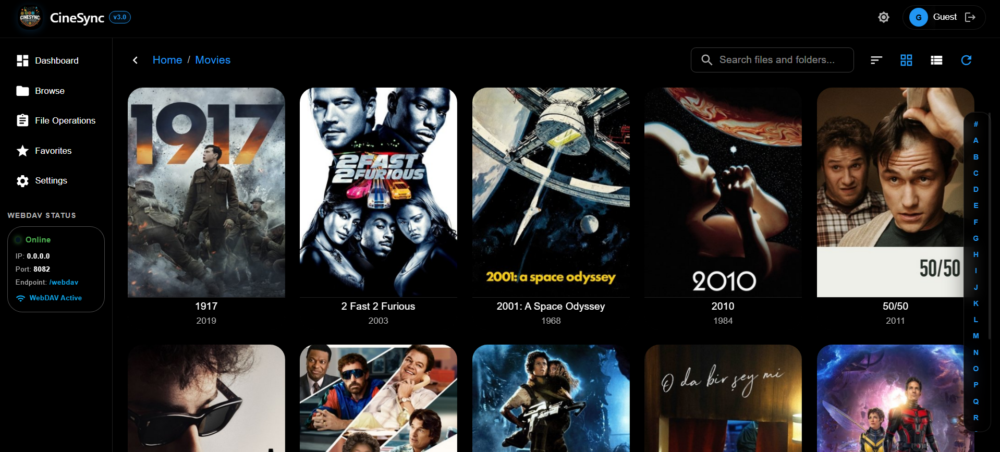
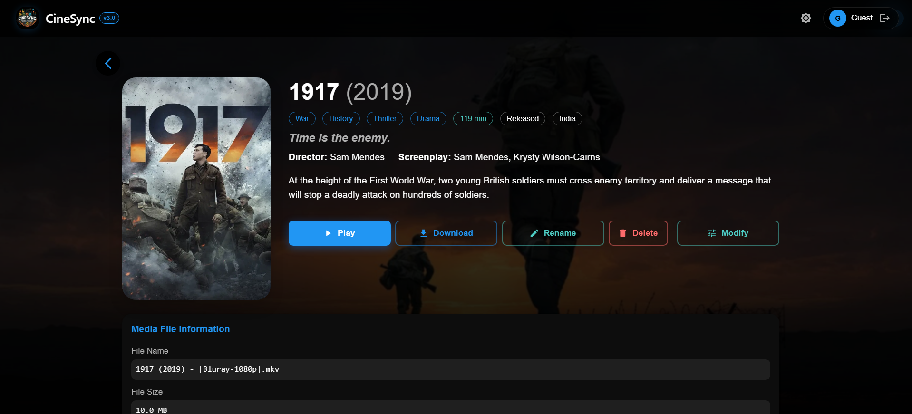

  
  
  

  
  

# CineSync - Organize Your Media Library Easily

CineSync is a comprehensive media library management system designed to efficiently organize libraries for Movies & TV shows, eliminating the need for Sonarr/Radarr. With its modern web interface, real-time monitoring, and advanced automation features, CineSync streamlines the organization of your library while providing full control over your data locally. While highly optimized for debrid platforms, CineSync is also versatile and works effectively with non-debrid platforms.

# CineSync Web Interface

CineSync features a **modern web interface** for complete library management with professional-grade tools and real-time monitoring.

  

### 📸 Interface Screenshots

  
  

  
  

# How CineSync Works ?

CineSync creates symbolic links from source directories to destination directories, organizing them according to your preferences and metadata from TMDb/IMDb/TVDB. This approach allows you to maintain a well-structured library without physically moving or duplicating files, preserving disk space while enabling advanced organization features.

## What's New in CineSync

- **🌐 Modern Web Interface** - Complete web-based dashboard with file browser, settings management, and real-time monitoring
- **🤖 Auto-Processing** - Intelligent automation that processes media files as they're discovered
- **📊 Advanced Analytics** - Comprehensive dashboard with media statistics, recent activity, and system monitoring
- **🎯 Smart Content Separation** - Automatic categorization for Kids content, 4K media, and Anime with customizable rules
- **🔄 Real-Time Updates** - Live dashboard updates and instant media server integration (Plex/Jellyfin/Emby)
- **🗃️ Database Management** - Built-in database with export capabilities and advanced search functionality

## Web Interface Features

- **📊 Interactive Dashboard**: Real-time statistics, recent media tracking, and system monitoring
- **📁 Advanced File Browser**: Navigate, manage, and organize your media library with drag-and-drop support
- **⚙️ Settings Management**: Configure all CineSync options through an intuitive web interface
- **🔍 Smart Search**: Advanced search and filtering capabilities with alphabet indexing
- **📈 Analytics & Reporting**: Detailed insights into your media collection and processing activities
- **🔄 Real-Time Updates**: Live notifications and automatic refresh of library changes
- **🎯 Auto-Processing Controls**: Enable/disable automatic processing with toggle controls
- **🗃️ Database Management**: Export, search, and manage your media database
- **🔐 Secure Authentication**: JWT-based authentication with configurable access controls

With **CineSync's integrated web interface**, your **media library is instantly manageable** across multiple devices with professional-grade tools and real-time automation.

For detailed configuration and usage, visit the [Web Interface Guide](https://github.com/sureshfizzy/CineSync/wiki/Web-Interface).

## 🚀 Installation

Ready to get started? CineSync supports multiple installation methods to fit your environment.

**📖 [Complete Installation Guide](https://github.com/sureshfizzy/CineSync/wiki/Installation)** - Docker, manual setup, system requirements, and troubleshooting

## ⚡️ Easy Mode (ElfHosted)

❤️ CineSync is proudly [sponsored](https://github.com/sponsors/sureshfizzy) by ElfHosted (*along with many more excellent [open-source projects](https://docs.elfhosted.com/sponsorship/)*!)

What is ElfHosted? [ElfHosted](https://store.elfhosted.com) is "easy mode" for self-hosting - an [open-source](https://docs.elfhosted.com/open/) PaaS which runs runs over 100 popular self-hostable apps for you, reliably and securely. They take responsibility for the painful stuff (*hardware, security, configuration, automation and updates*), so you sit back and enjoy the fun stuff! (*actually **using** your applications!*)

Popular [streaming bundles](https://store.elfhosted.com/product-category/streaming-bundles/) are available with Plex, Jellyfin, or Emby, integrated with cloud storage like RealDebrid, Premiumize, etc, and tooled with heavy-hitters such as Radarr/Sonarr, [CineSync](https://store.elfhosted.com/product/cinesync/) (*hello!*), Riven, [Stremio Addons](https://store.elfhosted.com/product-category/stremio-addons/) and [more](https://store.elfhosted.com/product-category/apps/).

ElfHosted have an ["excellent" ⭐️⭐️⭐️⭐️⭐️ rating on TrustPilot](https://www.trustpilot.com/review/elfhosted.com), a well-moderated [Discord](https://discord.elfhosted.com) community (*[highly praised](https://docs.elfhosted.com/testimonials/) for support and friendliness*), and [comprehensive documentation and guides](https://docs.elfhosted.com) resource.

Grab a [7-day trial for only $1](https://store.elfhosted.com), and experience ElfHosted for yourself! 🎉

## Documentation

For comprehensive guides and configuration options, visit our Wiki:

- [🏠 Getting Started](https://github.com/sureshfizzy/CineSync/wiki) - Overview and quick setup
- [📦 Installation Guide](https://github.com/sureshfizzy/CineSync/wiki/Installation) - Docker and manual installation
- [⚙️ Configuration Options](https://github.com/sureshfizzy/CineSync/wiki/Configuration) - Complete configuration reference
- [🌐 Web Interface Guide](https://github.com/sureshfizzy/CineSync/wiki/Web-Interface) - Web dashboard and features
- [🎯 Advanced Features](https://github.com/sureshfizzy/CineSync/wiki/Advanced-Features) - Auto-processing, content separation, and automation
- [📖 Usage Guide](https://github.com/sureshfizzy/CineSync/wiki/Usage) - Command-line and web interface usage
- [🐳 Docker Volumes](https://github.com/sureshfizzy/CineSync/wiki/Volumes) - Docker configuration for media servers

## Docker Hub Repository

The CineSync Docker image is available on Docker Hub:

- [CineSync Docker Image](https://hub.docker.com/r/sureshfizzy/cinesync)

## Supported Architectures

- `amd64` (x86_64)
- `arm64` (aarch64)

## Real-Time Monitoring & Automation

CineSync features advanced real-time monitoring and automation capabilities that keep your media library perfectly organized without manual intervention. The modern web interface provides complete control over automation settings and real-time monitoring of all processing activities.

### 🔄 Intelligent Monitoring System

- **Smart File Detection**: Advanced algorithms detect new media files instantly using filesystem events
- **Auto-Processing Mode**: Toggle automatic processing through the web interface for hands-free operation
- **Streaming Integration**: Real-time updates to media servers (Plex/Jellyfin/Emby) ensure instant library refresh
- **Duplicate Prevention**: Intelligent deduplication prevents processing the same content multiple times

### 🤖 Automated Workflows

- **Initial Smart Scan**: Comprehensive library analysis and organization on startup
- **Continuous Monitoring**: Real-time detection of new files with configurable monitoring intervals
- **Batch Processing**: Efficient handling of multiple files with parallel processing capabilities
- **Error Recovery**: Automatic retry mechanisms for failed operations with exponential backoff

### 📊 Real-Time Dashboard Updates

- **Live Statistics**: Dashboard updates in real-time showing processing progress and library stats
- **Recent Media Tracking**: Automatic tracking and display of recently added content
- **Processing Queue**: Visual monitoring of current and pending file operations

CineSync’s real-time monitoring is now a core feature of the script and Docker images, allowing for seamless integration into your workflow. With this feature, users can effortlessly manage their media library and maintain a well-organized collection of files.

### ⚙️ Customizable Automation

- **Flexible Scheduling**: Configurable monitoring intervals and processing schedules
- **Content-Specific Rules**: Different automation rules for movies, TV shows, anime, and kids content
- **Smart Cleanup**: Automatic removal of broken symlinks and orphaned database entries

### 🔗 Media Server Integration

- **Jellyfin/Emby Integration**: Instant library refresh using [inotify-compatible symlinks](https://jellyfin.org/docs/general/administration/troubleshooting#real-time-monitoring)
- **Plex Integration**: Automatic library scanning and updates via Plex API
- **Direct Streaming**: Real-time availability of organized content through multiple access methods

CineSync's automation system transforms media management from a manual chore into a seamless, intelligent process that works continuously in the background.

### 🎯 Smart Content Separation

- **Kids Content Detection**: Automatically separate family-friendly content based on TMDB ratings (G, PG, TV-Y, TV-G, TV-PG) and family genres
- **4K Content Organization**: Automatic detection and separation of 4K/UHD content into dedicated folders
- **Anime Classification**: Specialized handling for anime content with separate organization for anime movies and TV shows
- **Resolution-Based Sorting**: Intelligent sorting by video quality (720p, 1080p, 4K, etc.)

### 📁 Flexible Organization Options

- **CineSync Layout**: Simplified organization into Movies and Shows directories
- **Source Structure Preservation**: Maintain original folder structures when preferred
- **Custom Folder Naming**: Configurable folder names for different content types
- **Collection-Based Grouping**: Organize movie franchises and collections together

## Contributors

- [Suresh S](https://github.com/sureshfizzy) ❤️
- Special thanks to [Paolo](https://github.com/RunAway189) for testing the application! 🙏